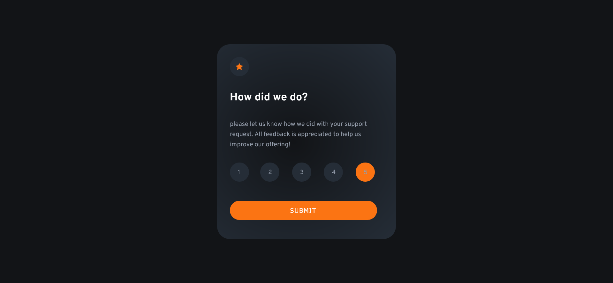
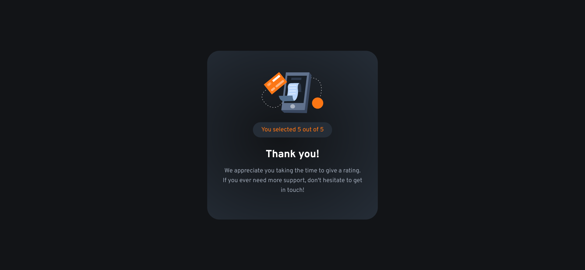
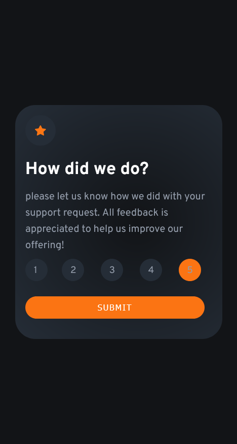
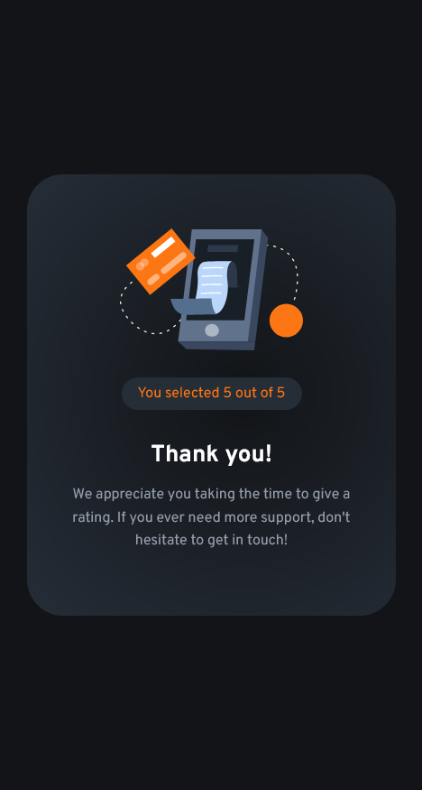

# Frontend Mentor - Interactive rating component solution

This is a solution to the [Interactive rating component challenge on Frontend Mentor](https://www.frontendmentor.io/challenges/interactive-rating-component-koxpeBUmI). Frontend Mentor challenges help you improve your coding skills by building realistic projects. 

### The challenge

Users should be able to:

- View the optimal layout for the app depending on their device's screen size
- See hover states for all interactive elements on the page
- Select and submit a number rating
- See the "Thank you" card state after submitting a rating

### Screenshot

## Desktop layout version



# Mobile layout version



### Links

- Solution URL: [github - yorchAdalbert](https://github.com/yorchAdalbert/interactive-rating-component)
- Live Site URL: [Interactive Rating Component](https://yorchadalbert.github.io/interactive-rating-component/)

### Built with

- Semantic HTML5 markup
- CSS custom properties
- Flexbox
- Responsive
- JavaScript

### What I learned

I learned to modify the radio button style and store its value, using it in another page with the help of a script.
I also learned to create a function that takes the radio value and store it using localStorage and print that value in another page.

```js
function getRadioValue() {
    let rate = document.getElementsByName('rate');

    for (let i = 0; i < rate.length; i++) {
        if (rate[i].checked) {
            localStorage.setItem('rate', rate[i].value);
        }
    }

}
```

## Author

- Website - [Jorge Rodriguez](http://www.yorchadalbert.com)
- Frontend Mentor - [@yorchAdalbert](https://www.frontendmentor.io/profile/yorchAdalbert)